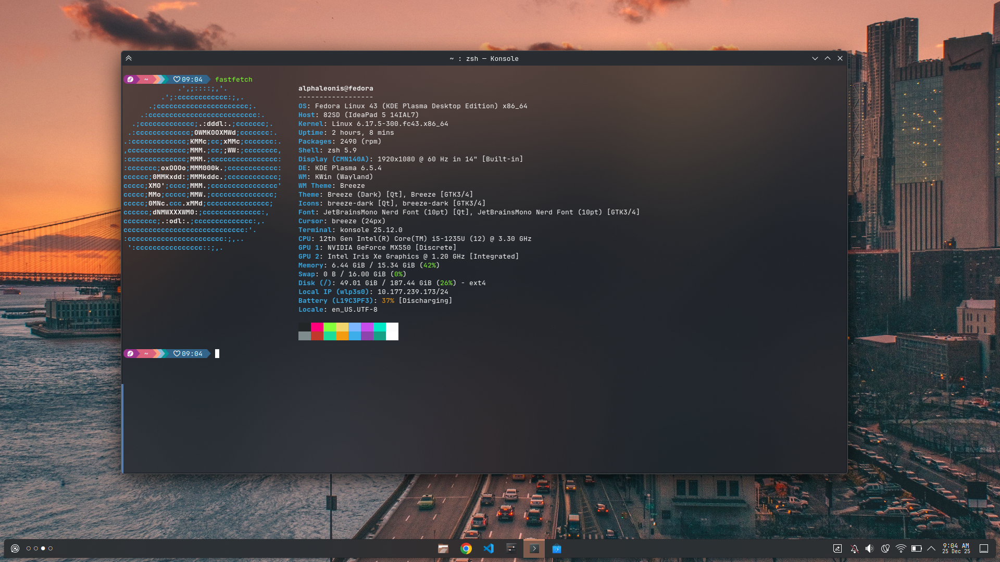

# My Simple Workspace Dotfiles

This config is include:

- [VS Code](https://code.visualstudio.com/) config
- [NeoVim](https://neovim.io/) config using [NVChad](https://nvchad.com/)
- ZSH as shell using [Oh My Zsh](https://ohmyz.sh/) and [Starship](https://starship.rs/)
- My Fonts
- My Wallpaper

### Others Consideration Tools

- I am currently using KDE Plasma as my desktop environtment but the config i mentioned should work on all DE.
- I am using additional plugin for for ZSH which is: autosuggesions and zsh-fast-syntax-highlighting as mentioned in [this](https://gist.github.com/n1snt/454b879b8f0b7995740ae04c5fb5b7df) gist page.
- I am using [FNM](https://github.com/Schniz/fnm) as node.js version manager
